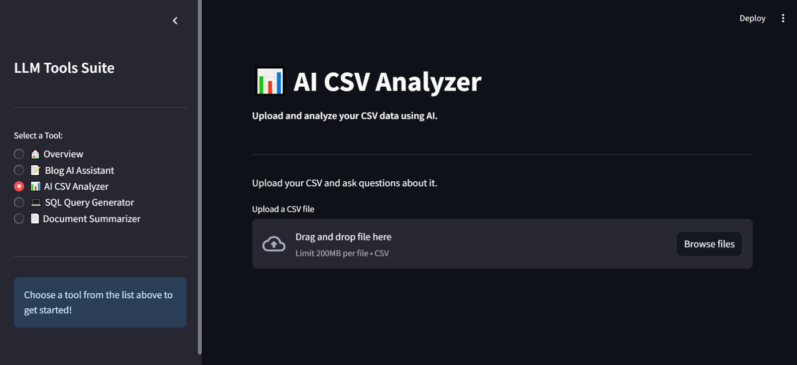

# LLM Tools Suite

## 📛 Badges

[](https://llm-tools-suite.streamlit.app/)
[](LICENSE)
[](https://streamlit.io/)
[](https://ai.google.dev/)
[](https://www.langchain.com/)
[](https://github.com/facebookresearch/faiss)
[](https://www.python.org/)
[](https://streamlit.io/cloud)

---

An integrated suite of AI-powered tools designed to enhance productivity by leveraging advanced Large Language Models. The platform provides a unified interface for content generation, data analysis, SQL query creation, document and website summarization, code explanation, and more.

**Live Demo:** [https://llm-tools-suite.streamlit.app/](https://llm-tools-suite.streamlit.app/)

---

## Features

The LLM Tools Suite includes the following specialized modules within a single Streamlit application:

* **AI Assistant**
  A professional conversational AI assistant offering quick, accurate responses. *(Default landing page)*

* **Blog AI Assistant**
  Generate high-quality, engaging blog posts using AI based on titles, keywords, and desired lengths.

* **AI CSV Analyzer**
  Upload CSV files and explore your data intelligently with LLM-powered natural language queries.

* **SQL Query Generator**
  Convert natural language descriptions into syntactically correct SQL queries, supporting multiple dialects.

* **Document Summarizer**
  Upload PDF or Word documents and receive concise, accurate summaries with download options.

* **Website Summarizer**
  Provide a URL to summarize webpage content quickly and download the summary.

* **Code Explainer** *(New)*
  Paste code snippets in popular languages and receive a detailed explanation including:

  * The full original code snippet
  * A comprehensive overview of the entire snippet
  * A line-by-line breakdown explaining syntax, logic, and key components

---

## Screenshots

### AI Assistant


### Blog AI Assistant


### AI CSV Analyzer



### SQL Query Generator


### Document Summarizer


### Website Summarizer


### Code Explainer

*(Add your screenshot here)*

---

## Project Structure

```
llm-tools-suite/
│
├── tools/
│   ├── blog_assistant.py
│   ├── code_explainer.py           # New tool for code explanations
│   ├── data_analyzer.py
│   ├── sql_query_generator.py
│   ├── document_summarizer.py
│   ├── document_summarizer_utils.py
│   └── website_summarizer.py
│
├── app.py                         # Main Streamlit app interface with multi-tab chat & UI improvements
├── README.md                      # Project documentation
├── requirements.txt               # Python dependencies
└── images/                        # Screenshot assets
```

---

## Installation

1. **Clone the repository**

   ```bash
   git clone https://github.com/MoustafaMohamed01/llm-tools-suite.git
   cd llm-tools-suite
   ```

2. **Install dependencies**

   ```bash
   pip install -r requirements.txt
   ```

3. **Set up your API key (Local development)**

   Create `.streamlit/secrets.toml` in the root folder and add:

   ```toml
   GEMINI_API_KEY = "your-gemini-api-key"
   ```

   Alternatively, export the key in your shell environment:

   ```bash
   export GEMINI_API_KEY="your-gemini-api-key"
   ```

   **Note:** Never commit your API keys to source control. `.streamlit/secrets.toml` and `.env` files are included in `.gitignore`.

---

## Deployment to Streamlit Community Cloud

1. Ensure your `requirements.txt` is accurate and `GEMINI_API_KEY` is accessed securely via environment variables (`os.getenv("GEMINI_API_KEY")`).

2. Go to [share.streamlit.io](https://share.streamlit.io/), log in, and create a new app linked to this repository.

3. Set the main file path as `app.py`.

4. In **Advanced settings / Secrets**, add:

   ```
   GEMINI_API_KEY="YOUR_ACTUAL_GEMINI_API_KEY_HERE"
   ```

5. Deploy and Streamlit will handle the hosting.

---

## Running Locally

```bash
streamlit run app.py
```

This launches the app, starting on the AI Assistant page. Use the sidebar to navigate between tools.

---

## Built With

* **Streamlit** – UI and web app framework
* **LangChain** – Managing LLM chains and document processing
* **Google Gemini API** – Large Language Model backend
* **FAISS** – Vector similarity search for document/website summarization
* **pypdf / python-docx** – PDF and Word document parsing
* **Requests & Beautiful Soup 4** – Web scraping for website summarization

---

## To-Do

* Add support for DOC file format (if not covered by `python-docx`)
* Enable chat-based interaction for CSV Analyzer for richer conversations
* Add user authentication for secure access
* Enhance summary download options (e.g., export as PDF)
* Add screenshot for Code Explainer tool

---

## Acknowledgements

Thanks to the open-source communities and teams behind [Streamlit](https://streamlit.io), [LangChain](https://www.langchain.com/), and [Google AI](https://ai.google/).

---

## About Me

**Moustafa Mohamed**
Aspiring AI Developer specializing in Machine Learning, Deep Learning, and LLM Engineering.

* **GitHub:** [MoustafaMohamed01](https://github.com/MoustafaMohamed01)
* **LinkedIn:** [Moustafa Mohamed](https://www.linkedin.com/in/moustafamohamed01/)
* **Kaggle:** [moustafamohamed01](https://www.kaggle.com/moustafamohamed01)
* **Portfolio:** [moustafamohamed.netlify.app](https://moustafamohamed.netlify.app/)

---
