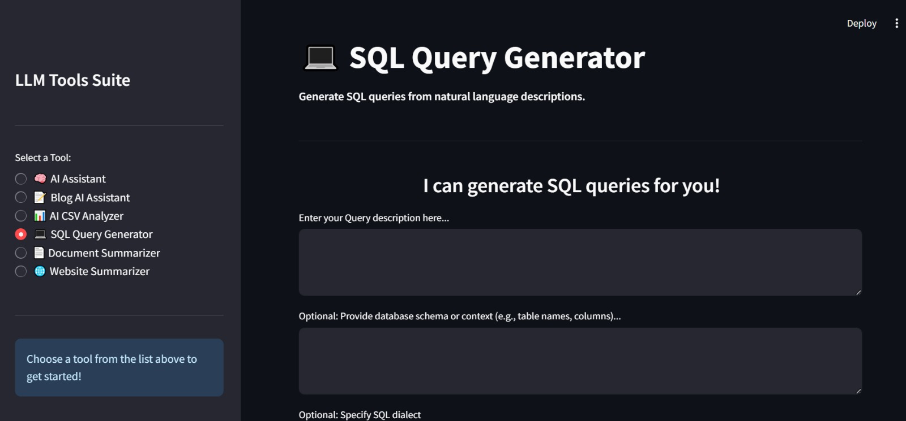

# LLM Tools Suite

## 📛 Badges

[](https://llm-tools-suite.streamlit.app/)
[](LICENSE)
[](https://streamlit.io/)
[](https://ai.google.dev/)
[](https://www.langchain.com/)
[](https://github.com/facebookresearch/faiss)
[](https://www.python.org/)
[](https://streamlit.io/cloud)

---

An integrated collection of AI-powered tools designed to enhance productivity and streamline various tasks using advanced Large Language Models. This suite offers a unified interface to access powerful features for content generation, data analysis, query creation, document summarization, and more.

**Live Demo Link:** [https://llm-tools-suite.streamlit.app/](https://llm-tools-suite.streamlit.app/)

-----

## Features

The LLM Tools Suite brings together several specialized modules in one convenient Streamlit application:

  * **🧠 AI Assistant**
    Engage in a professional conversation with an AI assistant for quick, accurate information. This is now the default landing page.

  * **📝 Blog AI Assistant**
    Generate high-quality blog content using AI based on a title, keywords, and desired word count.

  * **📊 AI CSV Analyzer**
    Upload your CSV files and analyze them intelligently using LLM-powered queries.

  * **💻 SQL Query Generator**
    Transform plain English into SQL queries with the help of AI.

  * **📄 Document Summarizer**
    Upload a PDF or Word document and get a concise summary in seconds, with the option to download the output.

  * **🌐 Website Summarizer**
    Provide a URL and get a concise summary of the web page content, with a convenient download option for the summary.

-----

## Screenshots

### 🧠 AI Assistant


### 📝 Blog AI Assistant


### 📊 AI CSV Analyzer


### 💻 SQL Query Generator


### 📄 Document Summarizer


### 🌐 Website Summarizer


-----

## Project Structure

```
llm-tools-suite/
│
├── tools/
│   ├── blog_assistant.py
│   ├── data_analyzer.py
│   ├── sql_query_generator.py
│   ├── document_summarizer.py
│   ├── document_summarizer_utils.py
│   └── website_summarizer.py
│
├── app.py                      # Main Streamlit app interface
├── README.md                   # Project documentation
├── requirements.txt            # Required Python packages
├── images/                     # Screenshots
└── .gitignore                  # Specifies untracked files to ignore (e.g., local API key, cached data)

```

-----

## Installation

1.  **Clone the Repository**

    ```bash
    git clone https://github.com/MoustafaMohamed01/llm-tools-suite.git
    cd llm-tools-suite
    ```

2.  **Install Requirements**

    ```bash
    pip install -r requirements.txt
    ```

3.  **Set Your API Key (Local Development)**

    For local development, create a file named `.streamlit/secrets.toml` in the root folder (or `api_key.py` if you prefer the old method and adjust your code to load from there).
    Add your Gemini API key:

    ```toml
    # .streamlit/secrets.toml
    GEMINI_API_KEY = "your-gemini-api-key"
    ```

    Alternatively, set it as an environment variable in your terminal:
    `export GEMINI_API_KEY="your-gemini-api-key"`

    **Important:** This `GEMINI_API_KEY` should **never** be committed directly to your GitHub repository. Ensure `.streamlit/secrets.toml` (or `api_key.py`) is listed in your `.gitignore` file.

-----

## Deployment to Streamlit Community Cloud

This application is designed for easy deployment to Streamlit Community Cloud.

1.  **Prepare for Deployment:**

      * Ensure your `requirements.txt` file accurately lists all necessary Python libraries.
      * Verify your code uses `os.getenv("GEMINI_API_KEY")` to access the API key, as direct key inclusion is unsafe and will not work on Streamlit Cloud.
      * Confirm that `api_key.py` (if you were using it locally) is in your `.gitignore` file.

2.  **Deploy on Streamlit Cloud:**

      * Go to [share.streamlit.io](https://share.streamlit.io/) and log in with your GitHub account.
      * Click "New app" and select your `llm-tools-suite` repository.
      * Choose your branch (e.g., `main`) and set "Main file path" to `app.py`.
      * **Crucially, under "Advanced settings" (or "Secrets"), add your `GEMINI_API_KEY` as a secret.** This allows Streamlit Cloud to securely provide your API key to your app without it being exposed in your code:
        ```
        GEMINI_API_KEY="YOUR_ACTUAL_GEMINI_API_KEY_HERE"
        ```
      * Click "Deploy\!" and Streamlit will handle the rest.

-----

## Run the App (Local)

```bash
streamlit run app.py
```

The app will open in your browser, defaulting to the **AI Assistant** page. You can switch between tools using the sidebar.

-----

## Built With

  * **Streamlit** – For building the web UI
  * **LangChain** – Managing LLM chains and document processing
  * **Google Gemini API** – Large Language Model (LLM) backend
  * **FAISS** – Vector search for summarization
  * **pypdf / python-docx** – Document parsing libraries
  * **Requests & Beautiful Soup 4 (BS4)** – For web scraping functionality in the Website Summarizer

-----

## To-Do

  * Add support for DOC files (if not already covered by `python-docx`)
  * Enable chat-based interaction for CSV analysis
  * Add user authentication for secure access
  * Enhance summary download options (e.g., specific file types like PDF for summarizers)

-----

## Acknowledgements

Thanks to the open-source community and developers of [Streamlit](https://streamlit.io), [LangChain](https://www.langchain.com/), and [Google AI](https://ai.google/).

-----

## About Me

**Moustafa Mohamed**
Aspiring AI Developer with a focus on **Machine Learning, Deep Learning**, and **LLM Engineering**.

  * **GitHub**: [MoustafaMohamed01](https://github.com/MoustafaMohamed01)
  * **Linkedin**: [Moustafa Mohamed](https://www.linkedin.com/in/moustafamohamed01/)
  * **Kaggle**: [moustafamohamed01](https://www.kaggle.com/moustafamohamed01)
  * **Portfolio**: [moustafamohamed](https://moustafamohamed.netlify.app/)

-----
